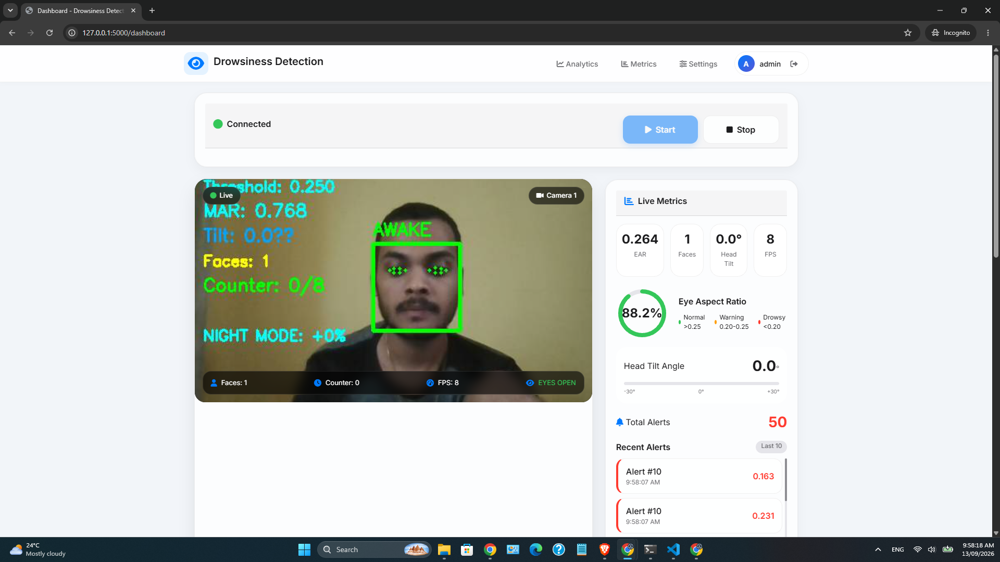

# Advanced Drowsiness Detection System

A real-time drowsiness detection system using computer vision and machine learning. Monitors driver fatigue through eye aspect ratio (EAR) and provides instant alerts.



## ✨ Features

- **Real-time Detection** - Monitors eye closure using Eye Aspect Ratio (EAR)
- **Web Dashboard** - Live video feed with statistics and controls
- **Instant Alerts** - Visual and audio alerts when drowsiness detected
- **Analytics** - Historical data with charts and statistics
- **Multi-user Support** - Login system with admin interface
- **Configurable** - Adjustable thresholds and settings
- **Night Mode** - Enhanced detection in low-light conditions
- **Data Logging** - Stores alerts and sessions for analysis

## 🚀 Quick Start

### Prerequisites
- Python 3.8 or higher
- Webcam
- 4GB RAM minimum

## Installation

```bash
# Clone the repository
git clone https://github.com/kshitish9/Real-Time-Driver-Drowsiness-Detection-System.git

# Navigate to the project directory
cd Real-Time-Driver-Drowsiness-Detection-System
```

# Install dependencies

```bash
pip install -r requirements.txt
```

# Run the application

```bash
python main.py
```
